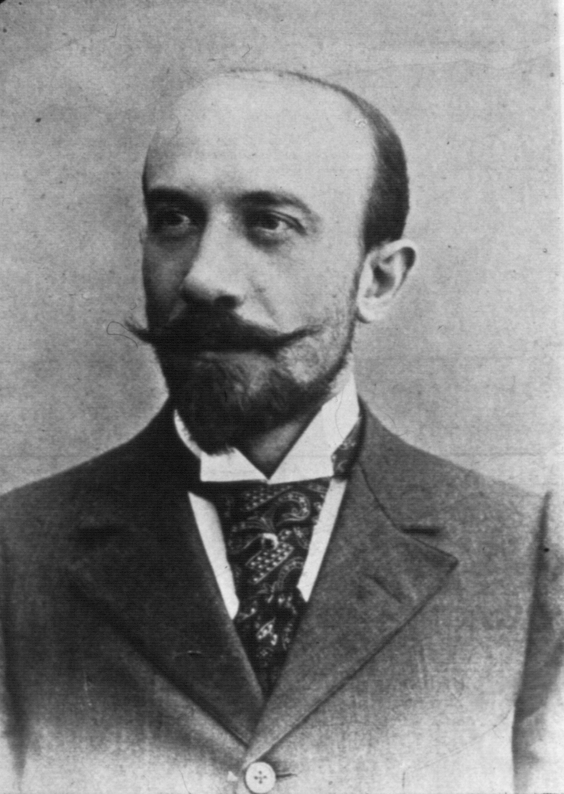
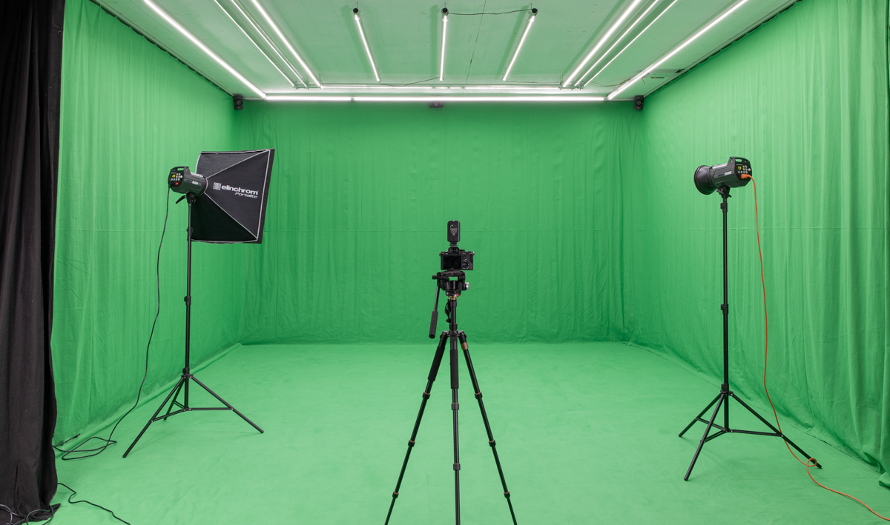

# Effets-speciaux
## Définition
#### Créer illusions et simuler objets, environnements, personnages ou phénomènes iréalistes
## Histoire
### Création
#### George Méliès en 1896

### Définition fond vert

#### C'est le principe de filmer une personne ou un objet devant un fond coloré dans le but de traiter le résultat à l’aide d’un logiciel. Ainsi, cette couleur deviendra transparente et il sera possible de permuter ce fond coloré et le transformer en image fixe ou en mouvement de son choix.
### Pourquoi le vert?

#### Ce fond doit être le plus efficace possible et pour ne pas voir disparaître des membres importants de  l’anatomie de la personne il se trouve que le vert est considérée comme étant la couleur la plus éloignée des tons de la peau humaine.De plus, les caméras vidéo sont plus sensibles au vert, les fonds vert nécessitent moins d’éclairage, ce qui peut être pratique
### Anciens mécanismes
#### Example: métropolis(1926), décors miniatures et mirroirs inclinés

### Mécanisme d'aujourd'hui
####  Elle consiste à placer l’objet/personnage au centre du fond vert puis de placer une première lumière principale (key light) sur un coté du personnage. Cette dernière va générer beaucoup d’ombres  qu’il faudra déboucher. Pour cela, une lumière de remplissage (fill light), qui fonctionnera de paire avec la lumière principale, éclairera les ombres générées par la key light, les ombres ne seront donc plus complètement noires. La lumière de remplissage peut être remplacée par un réflecteur qui apporte une lumière douce et plus diffuse. 
#### Enfin une lumière contre jour (back light), à l’arrière du personnage dirigé vers lui permettra de décoller le sujet du fond. Comme indiquez plus haut, une incrustation réussie dépend en grande partie de la séparation du personnage et du fond.
### Conseils
- le sujet doit être le plus éloigné possible du fond vert
– éclairez correctement votre fond vert
– éclairez correctement votre sujet
– utilisez une bonne caméra, au maximum de sa définition
– prenez un fond vert le plus pur possible
– pas de vert sur le sujet. Il est aussi important de choisir le bon vert, il faut un vert avec le plus de vert possible.
Le facteur le plus important pour une incrustation réussie c’est la séparation des couleurs entre le premier plan (le sujet) et le fond (l’écran).
### Anciens mécanismes
#### Example: métropolis(1926), décors miniatures et mirroirs inclinés
### Fin 
#### Merci de m'avoir écouter!
